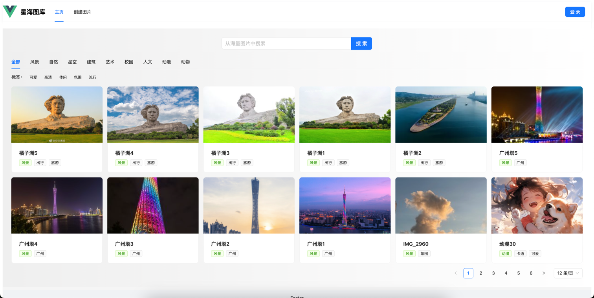
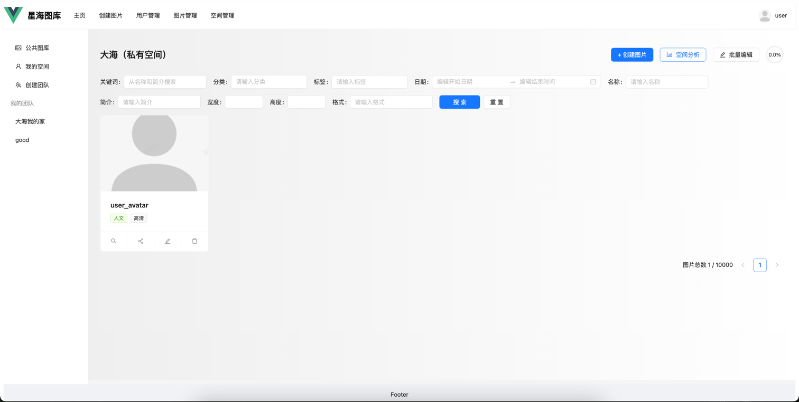

# 星海图库


**图库平台，提供公共、私有、团队共享三大图库模块，支持智能图片管理和实时协同编辑**

---

## 🎯 项目展示

### 📸 屏幕截图




---

## 🌐 相关链接

<!-- 根据你的项目实际情况选择添加 -->

*   **🌐 在线演示**： [立刻体验](http://119.29.154.154:88/)
*   **🖥️ 后端项目**： [https://github.com/defen2001/PicFlow-backend](https://github.com/defen2001/PicFlow-backend)

---


## 🛠️ 技术架构

### 前端技术栈
- 核心框架: Vue 3
- 开发语言: TypeScript
- 状态管理: Pinia
- UI 框架:
-  Ant Design Vue
-  路由: Vue Router
-  HTTP 请求: Axios
-  构建工具: Vite
-  代码规范: ESLint + Prettier
-  CSS 预处理器: SCSS/LESS
### 后端技术
*   **Spring Boot 2.7.x**
*   **Sa-Token 认证**
*   MySQL 8.0 + MyBatis Plus
*   Redis 6.x
*   **Disruptor 高性能队列**
*   **WebSocket**

### 存储方案
- 腾讯云 COS：图片存储

## 主要功能
- 图片上传
- 图片编辑
- 图片分类
- 图片搜索
- 空间创建
- 成员管理
- 空间分析

## 📦 快速开始

### 环境准备

#### 后端环境
- JDK 11+
- MySQL 8.0+
- Redis 6.x+
- Maven 3.6+
#### 前端环境
- Node.js 16+
- npm 8+

### 安装与运行

1.  克隆项目
    ```bash
    git clone https://github.com/defen2001/PicFlow-frontend.git
    cd PicFlow-frontend
    ```

4.  **构建**
    ```bash
    npm install
    ```
3. 运行
4. ```bash
   npm run dev
    ```

## 🤝 如何贡献
我们欢迎任何形式的贡献！


## 📄 许可证
本项目基于 MIT 许可证 - 查看 LICENSE 文件了解详情。

### 如果这个项目对你有帮助，请给个 ⭐ 支持一下！
